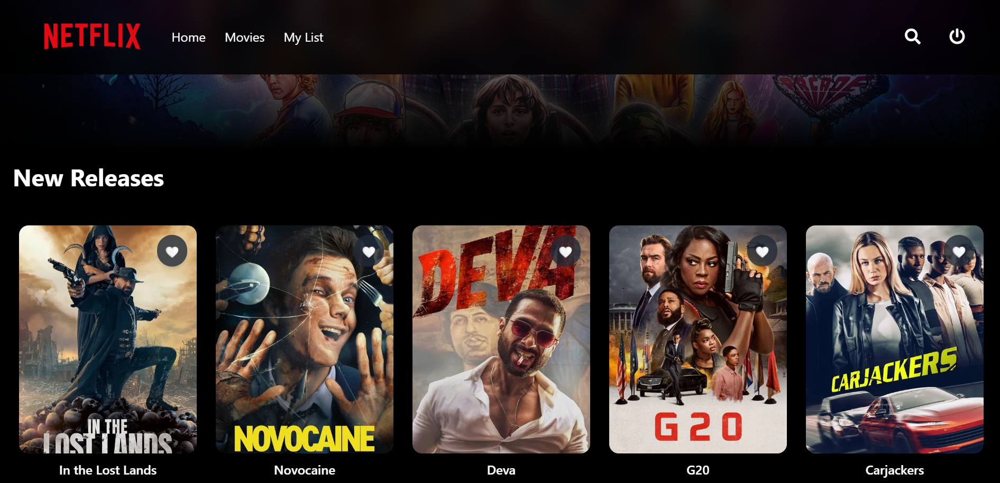

<div align="center">
  <br />
  <a href="https://www.youtube.com/watch?v=E-fdPfRxkzQ" target="_blank">
    
  </a>
  <br />

  <div>
    
    
    
    
    
  </div>

  <h1 align="center">Immersive 3D Portfolio</h1>
  <p align="center">Showcase your work in a captivating three-dimensional digital experience</p>
</div>

<details>
<summary>📑 Table of Contents</summary>

- [✨ Introduction](#introduction)
- [🚀 Live Demo](#live-demo)
- [🛠️ Tech Stack](#tech-stack)
- [🔋 Key Features](#features)
- [📸 Screenshots](#screenshots)
- [🏁 Getting Started](#quick-start)
- [📄 Project Structure](#project-structure)
- [🎮 Usage](#usage)
- [📱 Responsive Design](#responsive-design)
- [🔧 Performance Optimization](#performance)
- [🤝 Contributing](#contributing)
- [📝 License](#license)
- [👨‍💻 Author](#author)

</details>

## <a name="introduction">✨ Introduction</a>

Welcome to the **Immersive 3D Portfolio** - a cutting-edge personal website that transcends traditional portfolio design. By leveraging the power of Three.js and React, this project creates an engaging user experience with interactive 3D scenes, smooth camera transitions, and captivating animations.

Whether you're a developer, designer, or creative professional, this portfolio template offers an extraordinary way to showcase your skills, projects, and personality in a three-dimensional digital space that leaves a lasting impression.

## <a name="live-demo">🚀 Live Demo</a>

Experience the portfolio in action: [View Live Demo](https://your-portfolio-url.com)

## <a name="tech-stack">🛠️ Tech Stack</a>

This project is built using modern web technologies:

- **[Three.js](https://threejs.org/)** - 3D graphics library
- **[React Three Fiber](https://github.com/pmndrs/react-three-fiber)** - React renderer for Three.js
- **[Drei](https://github.com/pmndrs/drei)** - Useful helpers for React Three Fiber
- **[GSAP](https://greensock.com/gsap/)** - Professional animation library
- **[React 19](https://react.dev/)** - JavaScript UI library
- **[Tailwind CSS](https://tailwindcss.com/)** - Utility-first CSS framework
- **[Vite](https://vitejs.dev/)** - Next generation frontend tooling
- **[EmailJS](https://www.emailjs.com/)** - Send emails directly from JavaScript

## <a name="features">🔋 Key Features</a>

### Immersive 3D Experience

- **Realistic 3D Models** - Custom-crafted and optimized 3D assets
- **Dynamic Lighting & Shadows** - Physically-based rendering with ambient, directional, and point lights
- **Camera Animations** - Smooth transitions between sections
- **Interactive Elements** - Clickable 3D objects with hover effects

### Engaging User Interface

- **Scroll-Based Animations** - GSAP-powered interactions triggered by user scrolling
- **Micro Interactions** - Subtle animations and feedback on user actions
- **Custom Cursor Effects** - Enhanced cursor behavior for interactive elements
- **Loading Animations** - Elegant asset loading sequences

### Professional Portfolio Structure

- **Hero Section** - Eye-catching introduction with 3D scene
- **About Section** - Personal information with animated components
- **Projects Showcase** - Interactive gallery of work samples
- **Skills Display** - Visual representation of technical abilities
- **Contact Form** - Integrated email functionality
- **Responsive Design** - Optimized experience across all devices

### Developer Experience

- **Modular Architecture** - Reusable components and clean code structure
- **Performance Optimized** - Lazy loading and efficient rendering
- **SEO Ready** - Structured for search engine visibility
- **Easy Customization** - Well-documented codebase for simple personalization

## <a name="screenshots">📸 Screenshots</a>

<div align="center">
  
  <p>Hero Section with Interactive 3D Elements</p>
  <br/>
  
  <p>Projects Showcase with Dynamic Lighting</p>
</div>

## <a name="quick-start">🏁 Getting Started</a>

Follow these steps to set up the project locally on your machine:

### Prerequisites

Make sure you have the following installed:

- [Git](https://git-scm.com/)
- [Node.js](https://nodejs.org/) (v16 or higher)
- [npm](https://www.npmjs.com/) (Node Package Manager)

### Installation

1. **Clone the repository:**

```bash
git clone https://github.com/YourUsername/immersive-3d-portfolio.git
cd immersive-3d-portfolio
```

2. **Install dependencies:**

```bash
npm install
```

3. **Set up environment variables:**

Create a `.env` file in the root directory with the following:

```env
VITE_APP_EMAILJS_SERVICE_ID=your_service_id
VITE_APP_EMAILJS_TEMPLATE_ID=your_template_id
VITE_APP_EMAILJS_PUBLIC_KEY=your_public_key
```

4. **Start the development server:**

```bash
npm run dev
```

5. **Open your browser:**

Visit [http://localhost:5173](http://localhost:5173) to see the project in action!

## <a name="project-structure">📄 Project Structure</a>

```
/
├── public/                  # Static assets
│   ├── models/              # 3D model files (.glb, .gltf)
│   └── images/              # Images and textures
├── src/
│   ├── assets/              # Project assets
│   ├── components/          # Reusable components
│   │   ├── canvas/          # Three.js scene components
│   │   └── ui/              # User interface components
│   ├── constants/           # Project constants and data
│   ├── hooks/               # Custom React hooks
│   ├── pages/               # Application pages
│   ├── store/               # State management
│   ├── utils/               # Utility functions
│   ├── App.jsx              # Main application component
│   └── main.jsx             # Entry point
├── .env                     # Environment variables
├── index.html               # HTML entry point
├── package.json             # Project dependencies and scripts
├── tailwind.config.js       # Tailwind CSS configuration
└── vite.config.js           # Vite configuration
```

## <a name="usage">🎮 Usage</a>

### Customizing Your Portfolio

1. **Replace 3D Models:**
   - Add your custom models to the `public/models/` directory
   - Update model references in the canvas components

2. **Update Project Information:**
   - Edit the project data in `src/constants/index.js`

3. **Modify Content and Styling:**
   - Personalize text in the React components
   - Adjust Tailwind classes or update the theme in `tailwind.config.js`

4. **Configure Contact Form:**
   - Set up your EmailJS account
   - Update template IDs in the contact form component

### Deploying to Production

Build the project for production:

```bash
npm run build
```

Preview the production build locally:

```bash
npm run preview
```

Deploy the contents of the `dist` folder to your preferred hosting service.

## <a name="responsive-design">📱 Responsive Design</a>

The portfolio is fully responsive and optimized for various devices:

- **Desktop** - Full 3D experience with all interactive features
- **Tablet** - Adapted 3D scenes with touch controls
- **Mobile** - Simplified 3D elements with performance optimization

The responsive design automatically adjusts based on:
- Screen size and orientation
- Device capabilities
- Input methods (mouse, touch, etc.)

## <a name="performance">🔧 Performance Optimization</a>

The project implements several optimization techniques:

- **3D Model Compression** - Reduced polygon counts and texture sizes
- **Lazy Loading** - Components and assets loaded only when needed
- **Level of Detail (LOD)** - Simplified models for distant viewing
- **Render Throttling** - Optimized render cycles for smooth performance
- **Suspense and Preloading** - Improved asset loading experience

## <a name="contributing">🤝 Contributing</a>

Contributions are welcome! Feel free to open issues and submit pull requests.

1. Fork the repository
2. Create your feature branch (`git checkout -b feature/amazing-feature`)
3. Commit your changes (`git commit -m 'Add some amazing feature'`)
4. Push to the branch (`git push origin feature/amazing-feature`)
5. Open a Pull Request

## <a name="license">📝 License</a>

This project is licensed under the MIT License - see the [LICENSE](LICENSE) file for details.

## <a name="author">👨‍💻 Author</a>

**Your Name**

- Website: [your-website.com](https://your-website.com)
- GitHub: [@YourUsername](https://github.com/YourUsername)
- LinkedIn: [Your LinkedIn](https://linkedin.com/in/your-linkedin)

---

<div align="center">
  <p>If you found this project helpful, please consider giving it a ⭐!</p>
  <p>Built with ❤️ and a lot of ☕</p>
</div>
